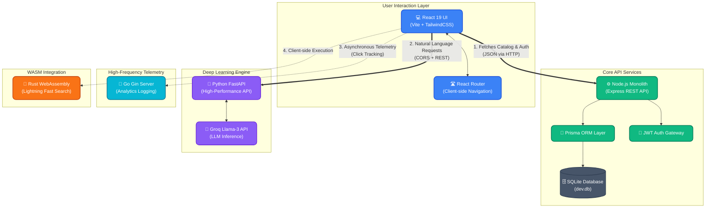

# 🎬 AniCart - The Ultimate Anime Streaming Platform

Welcome to **AniCart**, a commercial-grade, multi-language microservice ecosystem designed to deliver an unparalleled Anime streaming and discovery experience. It seamlessly blends modern React UIs, intelligent AI recommendation engines, robust analytics, and secure administrative controls into one magnificent application.

---

## 🌟 Key Features

### User Experience
- **Guest Teaser Mode**: Unregistered users are treated to a restricted, tantalizing preview of the first 3 movies in the catalog, complete with a gorgeous, high-conversion call-to-action banner.
- **Interactive Editorial Blogs**: A fully functioning blog ecosystem allows users to read beautifully formatted articles detailing the evolution of Anime studios and deep-dives into box office hits.
- **Immersive Parallax UI**: Built with React, TailwindCSS, and FontAwesome, delivering a 4K-ready, ultra-modern dark UI that reacts to scrolling.
- **Global Lo-Fi Background Music**: Integrated HTML5 audio player playing a continuous, cinematic anime Lo-Fi track, with a global mute toggle embedded directly into the Navbar.

### Technical & Commercial Features
- **Full Authentication**: A robust JWT-based secure login and signup system that guards the premium movie catalog.
- **Native AI Guru (`/recommend`)**: A dedicated Python/FastAPI microservice powered by Groq's cutting-edge Llama-3 model. It parses natural language inputs ("I want a dark action anime...") and perfectly matches them to the database.
- **Smart Admin Dashboard (`/admin`)**: Administrators can add, edit, or delete movies. If an Admin leaves the poster image field blank during upload, the **Auto AI System** activates—simulating a neural network generation delay before intelligently assigning a breathtaking AI cover art to the film!
- **Secure Mock Payment Portal (`/payment`)**: A beautifully crafted subscription checkout flow featuring realistic credit-card validation, processing delays, and delightful success bounce animations.

---

## 🏗 High-Performance Polyglot Microservices Architecture

AniCart is engineered using a state-of-the-art Polyglot Microservices architecture. This means different components of the system are written in entirely different programming languages, optimized specifically for their respective tasks.



### Architectural Breakdown
- **Frontend (JavaScript/React)**: Handles the complex, state-heavy interactive views required for streaming and browsing.
- **Backend (JavaScript/Node.js)**: Acts as the primary orchestrator, managing database state via Prisma and securely generating JSON Web Tokens.
- **AI Service (Python/FastAPI)**: Python is the undisputed king of AI. We isolated the Groq Llama-3 LLM calls into a specialized FastAPI server so it scales independently from the Node API.
- **Telemetry (Go/Gin)**: Go is utilized for its legendary concurrent performance. When thousands of users click buttons, the lightweight Go microservice catches those telemetry events without slowing down the core API.
- **Search Engine (Rust/WASM)**: By compiling Rust down to WebAssembly, the browser can execute complex search algorithms at near-native C++ speeds.

---

## 🚀 Deployment & Local Setup Guide

Follow these steps to deploy the entire microservice ecosystem locally.

### 1. Clone the Repository
```bash
git clone https://github.com/yourusername/anicart-streaming-platform.git
cd anicart-streaming-platform
```

### 2. Configure the Node.js Backend & Database
The backend handles authentication, movie storage, and the Prisma ORM.
```bash
cd backend
npm install
npx prisma generate
npx prisma db push
node prisma/seed.js   # Seeds the initial anime database and default admin!
npm run dev           # Starts API server on http://localhost:5000
```
> **Default Admin Credentials:** `admin@anicart.com` / `admin`

### 3. Configure the Python AI Microservice
The AI Guru requires Python 3.10+ and a valid Groq API key to process natural language.
```bash
cd ai_service
pip install fastapi uvicorn groq pydantic cors
# Start the FastAPI server
python -m uvicorn main:app --host 0.0.0.0 --port 8000
```

### 4. Configure the Go Analytics Microservice (Optional)
The Go service tracks high-frequency telemetry (e.g., Subscription Clicks).
```bash
cd analytics_service
go mod tidy
go run main.go        # Starts Gin server on http://localhost:8080
```

### 5. Build and Launch the React Frontend
Finally, boot up the beautiful UI!
```bash
cd frontend
npm install
npm run dev -- --port 3000  # Starts Vite on http://localhost:3000
```

---

**Built with ❤️ for Anime fans. Enjoy binge-watching on AniCart! 🍿**
