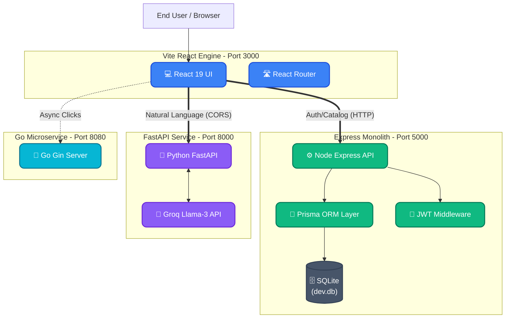
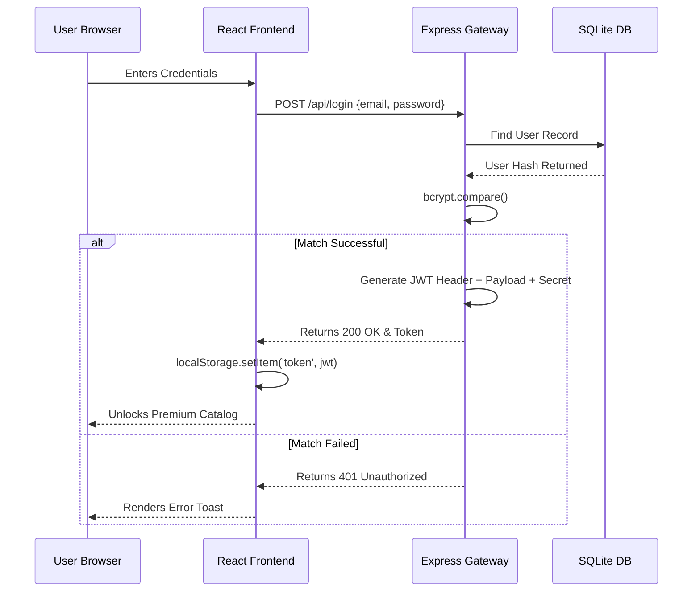
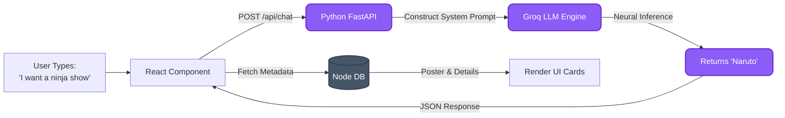

# 🎬 AniCart - The Ultimate Anime Streaming Platform

Welcome to **AniCart**, a commercial-grade, multi-language microservice ecosystem designed to deliver an unparalleled Anime streaming and discovery experience. It seamlessly blends modern React UIs, intelligent AI recommendation engines, robust analytics, and secure administrative controls into one magnificent application.

---

## 🌟 Key Features

### User Experience
- **Guest Teaser Mode**: Unregistered users are treated to a restricted, tantalizing preview of the first 3 movies in the catalog, complete with a gorgeous, high-conversion call-to-action banner.
- **Interactive Editorial Blogs**: A fully functioning blog ecosystem allows users to read beautifully formatted articles detailing the evolution of Anime studios and deep-dives into box office hits.
- **Immersive Parallax UI**: Built with React, TailwindCSS, and FontAwesome, delivering a 4K-ready, ultra-modern dark UI that reacts to scrolling.
- **Global Lo-Fi Background Music**: Integrated HTML5 audio player playing a continuous, cinematic anime Lo-Fi track, with a global mute toggle embedded directly into the Navbar.

### Technical & Commercial Features
- **Full Authentication**: A robust JWT-based secure login and signup system that guards the premium movie catalog.
- **Native AI Guru (`/recommend`)**: A dedicated Python/FastAPI microservice powered by Groq's cutting-edge Llama-3 model. It parses natural language inputs ("I want a dark action anime...") and perfectly matches them to the database.
- **Smart Admin Dashboard (`/admin`)**: Administrators can add, edit, or delete movies. If an Admin leaves the poster image field blank during upload, the **Auto AI System** activates—simulating a neural network generation delay before intelligently assigning a breathtaking AI cover art to the film!
- **Secure Mock Payment Portal (`/payment`)**: A beautifully crafted subscription checkout flow featuring realistic credit-card validation, processing delays, and delightful success bounce animations.

---

## 🏗 High-Performance Polyglot Architecture

AniCart is engineered using a state-of-the-art Polyglot Microservices architecture, split into specialized domains. Below are detailed visualizations of our system logic.

### 1. Global System Topology
This diagram illustrates how the core technologies physically interface across the network.



### 2. Authorization & Security Flow
This diagram details the lifecycle of a secure, authenticated request from a user.



### 3. AI Guru Recommendation Pipeline
This illustrates the microservice communication during a Natural Language search.



---

## 🚀 Deployment & Local Setup Guide

AniCart supports local deployment on Windows, macOS, and Linux. Choose your operating system below to begin.

### 1. Clone the Repository
Open your terminal and pull the ultimate AniCart repository:
```bash
git clone https://github.com/Neelanjan2448040/anicart-streaming-platform.git
cd anicart-streaming-platform
```

### 2. Install Node.js Backend & Database
*Prerequisite: Ensure [Node.js (v20+)](https://nodejs.org/) is installed on your machine.*

**For Windows (PowerShell):**
```powershell
cd backend
npm install
npx prisma generate
npx prisma db push
node prisma/seed.js
npm run dev
```

**For macOS / Linux (Bash/Zsh):**
```bash
cd backend
npm install
npx prisma generate
npx prisma db push
node prisma/seed.js
npm run dev
```

> **Default Admin Credentials:** `admin@anicart.com` / `admin`

### 3. Install Python AI Microservice
*Prerequisite: Ensure [Python (3.10+)](https://python.org/) is installed.*

**For Windows (PowerShell):**
```powershell
# Open a new terminal window
cd ai_service
pip install -r requirements.txt
python -m uvicorn main:app --host 0.0.0.0 --port 8000
```

**For macOS / Linux (Bash/Zsh):**
```bash
# Open a new terminal window
cd ai_service
pip3 install -r requirements.txt
python3 -m uvicorn main:app --host 0.0.0.0 --port 8000
```
> *Note: For production AI, you can export your custom `GROQ_API_KEY` into your environment variables.*

### 4. Install Go Analytics Microservice (Optional)
*Prerequisite: Ensure [Go (1.21+)](https://go.dev/) is installed.*

**For Windows / macOS / Linux:**
```bash
# Open a new terminal window
cd analytics_service
go mod tidy
go run main.go
```

### 5. Build and Launch the React Frontend
*This must be running to view the website.*

**For Windows / macOS / Linux:**
```bash
# Open a new terminal window
cd frontend
npm install
npm run dev -- --port 3000
```
**Access the platform:** Navigate to `http://localhost:3000` in your browser!

---

**Built with ❤️ for Anime fans. Enjoy binge-watching on AniCart! 🍿**
